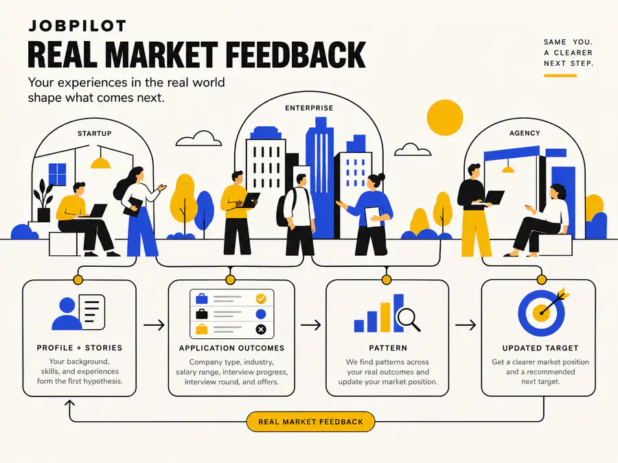
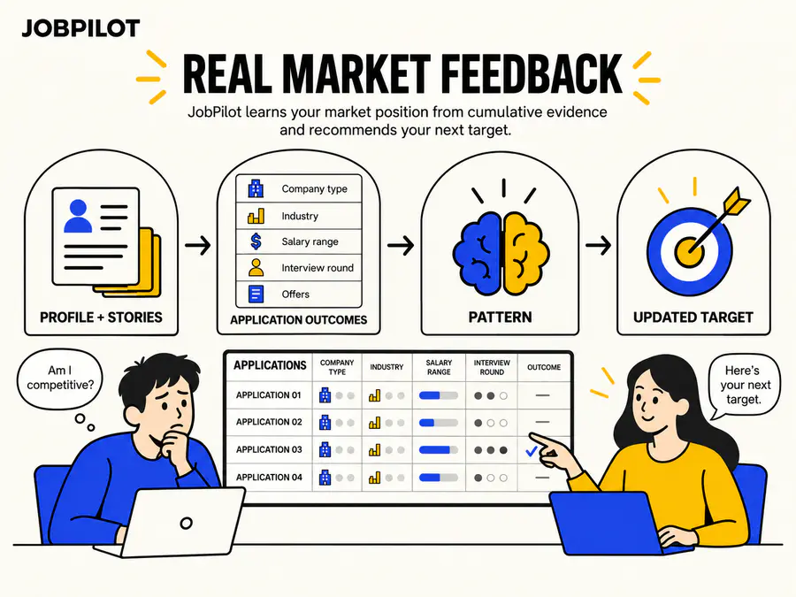
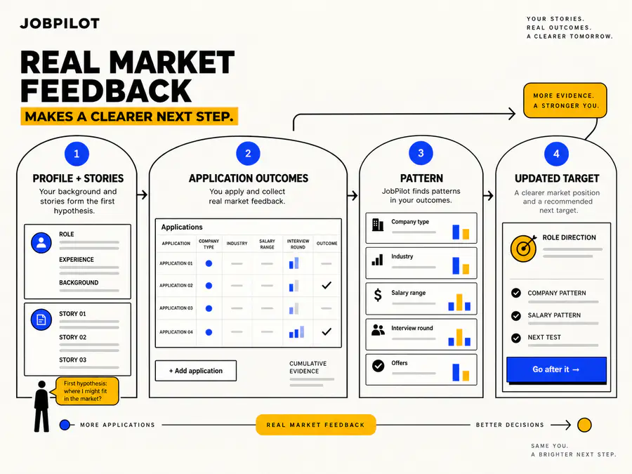
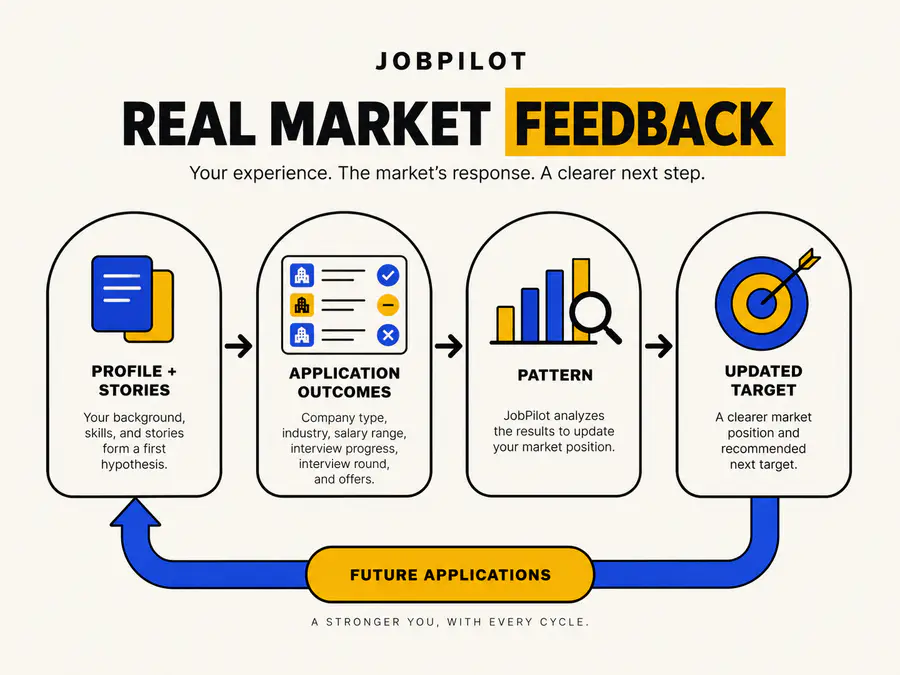

<div align="center">

# Kate Xu Storytelling

**Turn hard-to-explain ideas into narrative illustrations for an existing presentation deck.**

[How it works](#how-it-works) · [See the decision experience](#two-clear-decision-moments) · [Install](#installation) · [Use it](#usage)

</div>

## The problem it solves

Important moments in a case study often depend on a setting, a relationship, an argument, or a chain of cause and effect. Those moments become slow to understand when they are compressed into paragraphs or generic diagrams.

Kate Xu Storytelling analyzes an existing presentation, finds the few scenes where illustration can create immediate clarity, and integrates those illustrations into the deck's established visual language.

The result is a stronger story with memorable visual peaks and enough breathing room for screenshots, evidence, data, and product craft.

## What makes it different

- **Scene judgment:** scores candidate scenes by spatial, relational, causal, compression, and memorability value.
- **Selective intervention:** recommends two to four illustrated scenes for most decks.
- **User-controlled storytelling:** lets the user choose each Scene and edit what the audience should understand.
- **Fast visual choice:** presents four directly readable illustration directions labeled A, B, C, and D.
- **Deck-native output:** samples typography, shape language, and four or fewer colors from the source deck.
- **Evidence discipline:** preserves verified facts and keeps human judgment visible when AI supports synthesis.

## How it works


The skill works with a finished or substantially complete PPTX, PDF export, Figma Slides deck, Google Slides deck, or another readable presentation source. The source deck remains the narrative and visual foundation.

## Two clear decision moments

### 1. Choose the Scenes

The agent reads the complete deck and proposes up to five high-value Scenes. Each candidate includes:

- a semantic name and source slide range;
- a recognizable slide thumbnail;
- the current communication problem;
- an editable sentence describing what the illustration should make clear.

The user can select or remove Scenes, edit the visual focus, and add a missed Scene. A Scene Locator helps connect a user-added moment to the correct slide range.

### 2. Choose the illustration direction

The agent uses one representative Scene to generate four 4:3 previews. The story, facts, typography, palette, and content density stay consistent while the illustration treatment changes.

<table>
  <tr>
    <td width="50%"><br><div align="center"><strong>A</strong></div></td>
    <td width="50%"><br><div align="center"><strong>B</strong></div></td>
  </tr>
  <tr>
    <td width="50%"><br><div align="center"><strong>C</strong></div></td>
    <td width="50%"><br><div align="center"><strong>D</strong></div></td>
  </tr>
</table>

The user replies with one letter. The selected direction is then adapted to every approved Scene.

## Illustration judgment

Strong candidates usually include:

- interviews or field research followed by synthesis;
- a physical or social setting that changed the work;
- a disagreement, strategic fork, or meaningful tradeoff;
- a discovery barrier hiding valuable product capability;
- evidence becoming a pattern and then a decision;
- a feedback loop or many-to-one transformation;
- a system whose actors and relationships are difficult to explain with prose alone.

The skill protects the rhythm of the deck by spacing illustrated peaks between product evidence and quieter slides. Three consecutive infographic-heavy slides are avoided.

## Visual-language matching

Every illustration inherits its visual language from the presentation:

- heading, body, and label typography;
- background, ink, accent, and supporting colors;
- shape, stroke, corner, shadow, icon, and spacing conventions;
- aspect ratio and available insertion area.

Each infographic uses four or fewer deck-derived colors. Page-colored or transparent backgrounds help the artwork feel embedded in the story.

## Installation

### Codex

```bash
git clone https://github.com/KatieKatieXu/kate-xu-storytelling.git ~/.codex/skills/kate-xu-storytelling
```

### Claude Code

```bash
git clone https://github.com/KatieKatieXu/kate-xu-storytelling.git ~/.claude/skills/kate-xu-storytelling
```

### Other coding agents

Share this repository with an agent that can read files and work with presentation artifacts. Ask it to begin with [`SKILL.md`](SKILL.md) and load the linked references when each decision point is reached.

## Usage

Attach or link an existing presentation, then say:

> Use `$kate-xu-storytelling` to find the scenes in this deck that deserve illustration. Let me choose the Scenes and the A–D visual direction before integrating them.

The workflow will:

1. read the complete deck and its narrative sequence;
2. identify the strongest illustration opportunities;
3. let you choose and refine the Scenes;
4. show four readable visual directions;
5. integrate the chosen direction into the approved Scenes;
6. preserve unaffected slides and settled design decisions.

## Repository structure

```text
kate-xu-storytelling/
├── SKILL.md
├── agents/
│   └── openai.yaml
├── assets/
│   └── jobpilot-choice-a–d.webp
└── references/
    ├── agent-choice-interface.md
    └── scene-selection-interface.md
```

## Accuracy and confidentiality

The skill uses facts supported by the source deck and supplied artifacts. Metrics, quotes, participants, causality, outcomes, and confidential implementation details remain grounded in user-provided evidence.

---

Created by **Kate Xu** for clearer product storytelling.
